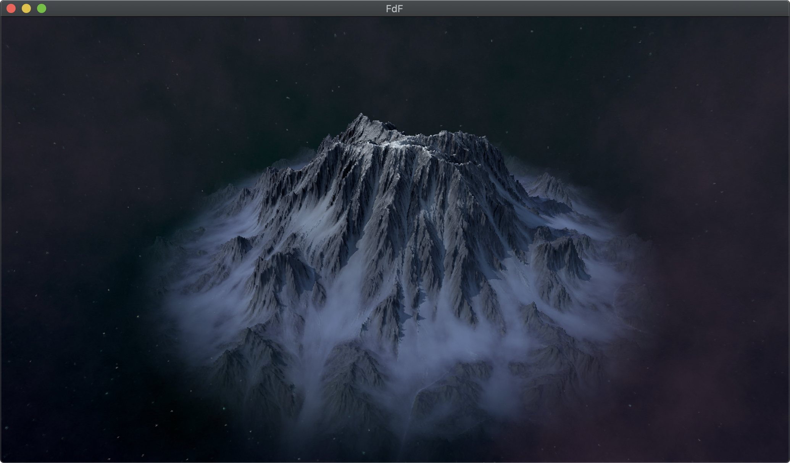
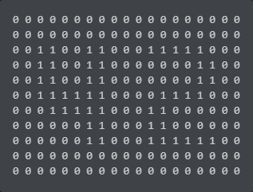
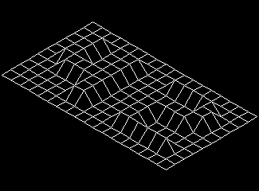
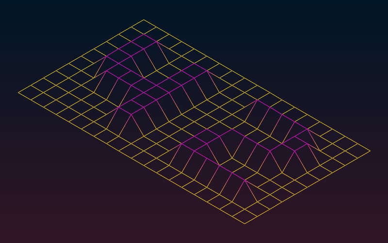
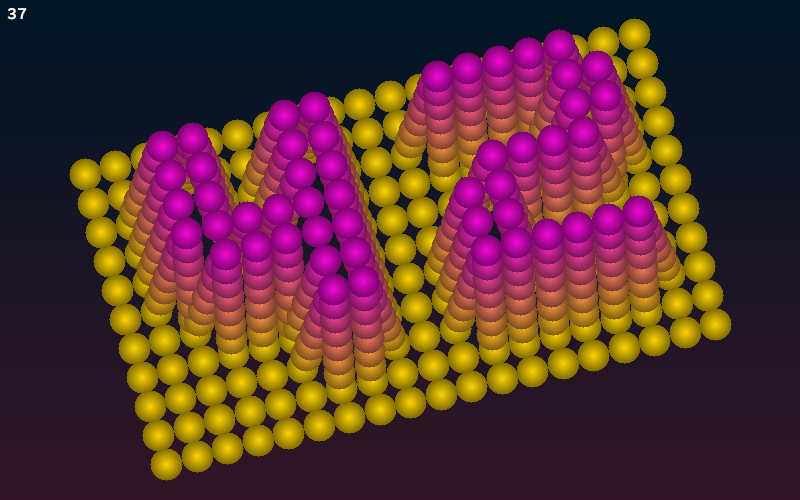
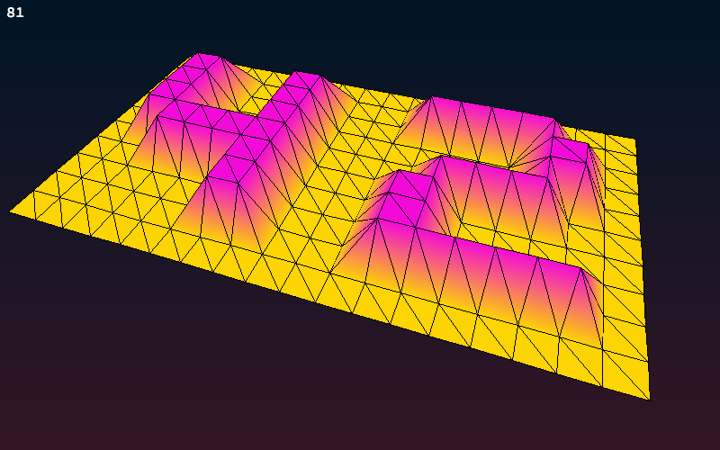
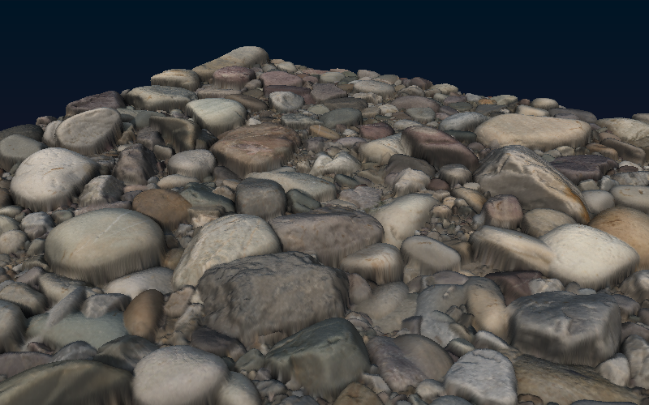
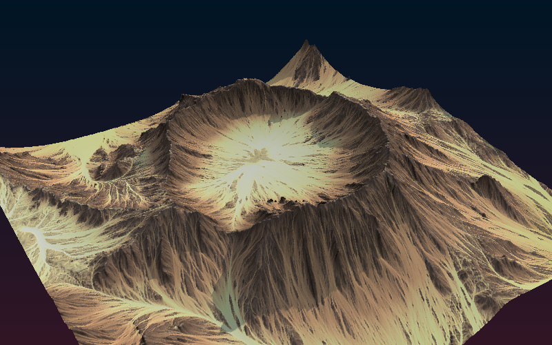
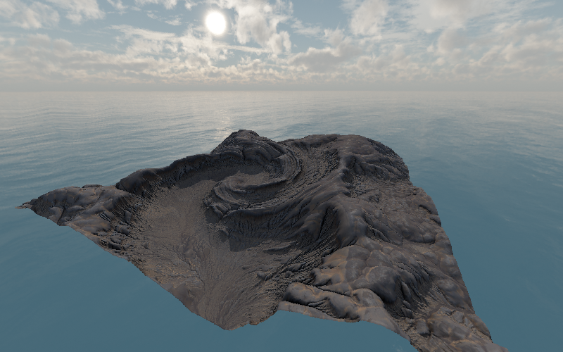

# Dependencies


#### Debian / Ubuntu
```
sudo apt update
sudo apt install cmake build-essential libx11-dev libglfw3-dev libglfw3 xorg-dev
```

#### Arch (x11)
```
sudo pacman -S glfw-x11
sudo pacman -S cmake
```

#### Arch (wayland)
```
sudo pacman -S glfw-wayland
sudo pacman -S cmake
```

#### MacOS
```
brew install glfw
brew install cmake
```

---

# Installation

```
git clone https://github.com/bewerner/FdF.git
cd FdF
make
```

---

# Usage

`./fdf path_to_heightmap.fdf`\
`./fdf path_to_heightmap.png`\
`./fdf path_to_heightmap.png path_to_colormap.png`

### Or use these presets to load the included maps:

`make ft`

`make alien`\
`make foggy`\
`make crater`

`make mud`\
`make pebbles`\
`make cobblestone`

---

# Controls

### Universal Controls:

| Key⠀⠀⠀⠀⠀⠀⠀⠀⠀⠀⠀⠀⠀⠀⠀⠀⠀⠀⠀⠀⠀	| Description⠀⠀⠀⠀⠀⠀⠀⠀⠀⠀⠀⠀⠀⠀⠀⠀⠀⠀⠀⠀⠀⠀⠀⠀⠀⠀⠀⠀⠀	|
|-------------------------------------------|---------------------------------------------------|
| <kbd>Scroll Wheel</kbd>					| Zoom												|
| <kbd>Left Mouse Button</kbd>				| Move mesh											|
| <kbd>Right  Mouse Button</kbd>			| Rotate mesh										|
| <kbd>Middle Mouse Button</kbd>			| Change height scale								|
| <kbd>Shift</kbd> + <kbd>Scroll Wheel</kbd>| Change Field of View								|
| <kbd>R</kbd> or <kbd>Double Click</kbd>	| Reset map position								|
| <kbd>P</kbd>								| Perspective projection							|
| <kbd>O</kbd>								| Orthographic projection							|
| <kbd>I</kbd>								| Isometric projection								|
| <kbd>Shift</kbd> + <kbd>↑</kbd>			| Increase height scale								|
| <kbd>Shift</kbd> + <kbd>↓</kbd>			| Decrease height scale								|
| <kbd>S</kbd>								| Change skybox										|
| <kbd>Shift</kbd> + <kbd>S</kbd>			| Toggle skybox										|
| <kbd>F</kbd>								| Toggle FPS (Frames per second)					|

### Draw Modes:

| Key⠀⠀⠀⠀⠀⠀⠀⠀⠀⠀⠀⠀⠀⠀⠀⠀⠀⠀⠀⠀⠀	| Description⠀⠀⠀⠀⠀⠀⠀⠀⠀⠀⠀⠀⠀⠀⠀⠀⠀⠀⠀⠀⠀⠀⠀⠀⠀⠀⠀⠀⠀	|
|-------------------------------------------|---------------------------------------------------|
| <kbd>1</kbd>								| Draw vertices										|
| <kbd>2</kbd>								| Draw dotted edges									|
| <kbd>3</kbd>								| Draw edges										|
| <kbd>4</kbd>								| Draw faces										|
| <kbd>5</kbd>								| Draw faces and edges								|
| <kbd>6</kbd>								| Draw skybox/background only						|

### Edge Mode Controls: ( <kbd>4</kbd> )

| Key⠀⠀⠀⠀⠀⠀⠀⠀⠀⠀⠀⠀⠀⠀⠀⠀⠀⠀⠀⠀⠀	| Description⠀⠀⠀⠀⠀⠀⠀⠀⠀⠀⠀⠀⠀⠀⠀⠀⠀⠀⠀⠀⠀⠀⠀⠀⠀⠀⠀⠀⠀	|
|-------------------------------------------|---------------------------------------------------|
| <kbd>A</kbd>								| Toggle antialiasing								|
| <kbd>↑</kbd>								| Increase line thickness (only with AA disabled)	|
| <kbd>↓</kbd>								| Decrease line thickness (only with AA disabled)	|

### Vertex Mode Controls: ( <kbd>1</kbd> )

| Key⠀⠀⠀⠀⠀⠀⠀⠀⠀⠀⠀⠀⠀⠀⠀⠀⠀⠀⠀⠀⠀	| Description⠀⠀⠀⠀⠀⠀⠀⠀⠀⠀⠀⠀⠀⠀⠀⠀⠀⠀⠀⠀⠀⠀⠀⠀⠀⠀⠀⠀⠀	|
|-------------------------------------------|---------------------------------------------------|
| <kbd>↑</kbd>								| Increase vertex size	$\color{red}*$				|
| <kbd>↓</kbd>								| Decrease vertex size	$\color{red}*$				|

### Dotted Edge Mode Controls: ( <kbd>2</kbd> )

| Key⠀⠀⠀⠀⠀⠀⠀⠀⠀⠀⠀⠀⠀⠀⠀⠀⠀⠀⠀⠀⠀	| Description⠀⠀⠀⠀⠀⠀⠀⠀⠀⠀⠀⠀⠀⠀⠀⠀⠀⠀⠀⠀⠀⠀⠀⠀⠀⠀⠀⠀⠀	|
|----------------------------------------|-------------------------------------------------|
| <kbd>↑</kbd>							 | Increase dot size		$\color{red}*$			|
| <kbd>↓</kbd>							 | Decrease dot size		$\color{red}*$			|
| <kbd>→</kbd>							 | Increase dot density		$\color{red}*$			|
| <kbd>←</kbd>							 | Decrease dot density		$\color{red}*$			|


$\color{red}*$ *Only use on small maps! Might freeze the program.*

# Description

The goal of this project was to represent any given heightmap as a wireframe model in isometric view using the [MLX42](https://github.com/codam-coding-college/MLX42) library.

| Heightmap text file						| Graphical representation:⠀⠀⠀⠀⠀⠀⠀⠀⠀⠀⠀⠀⠀⠀⠀⠀⠀⠀⠀⠀	|
|-------------------------------------------|---------------------------------------------------|
| 						| 							|

The bonus task was to add an additional projection, add the ability to zoom, translate and rotate the model. Since I really enjoyed this project, I decided to add many more features like colors and antialiasing.



Next, I added a FPS display and some alternative draw modes to represent the heightmap in different ways.





I decided to add the ability to load PNG heightmaps in order to get more interesting models. In addition to the heightmap, a diffuse/colormap can also be read to assign the respective color to each vertex.





In order to complete the environment, I also added a skybox



---

# Bonus Features

- Free mesh rotation and zoom
- Perspective projection and adjustable Field of View
- Antialiased lines
- Adjustable height scale
- Skybox environment
- Color gradient from lowest to highest point
- Ability to load PNG heightmaps and colormaps
- FPS display (frames per second)
- Additional draw modes:
	- Vertices only
	- Dotted edges
	- Edges
	- Faces
	- Faces and edges

---

# Assets

#### Skyboxes

[Sky 2 by Antoan Shiyachki](https://design.tutsplus.com/articles/freebie-8-awesome-ocean-hdris--cg-5684) \
[Sky 3 by komaokc](https://gamebanana.com/mods/7269)

#### Heightmaps

[Alien by Artem Polovianov](https://www.artstation.com/marketplace/p/d507g/alien-landscape-vol-2-30-terrain-mesh-displacement-map-texture-pack/) \
[Foggy and Crater by Ozhichige](https://ozhichige.gumroad.com/l/WragC)

#### Materials

[Mud by Dario Barresi and Dimitrios Savva](https://polyhaven.com/a/mud_cracked_dry_03) \
[Cobblestone by Sơn Nguyễn](https://polyhaven.com/a/mossy_cobblestone) \
[Pebbles by Amal Kumar](https://polyhaven.com/a/ganges_river_pebbles)
